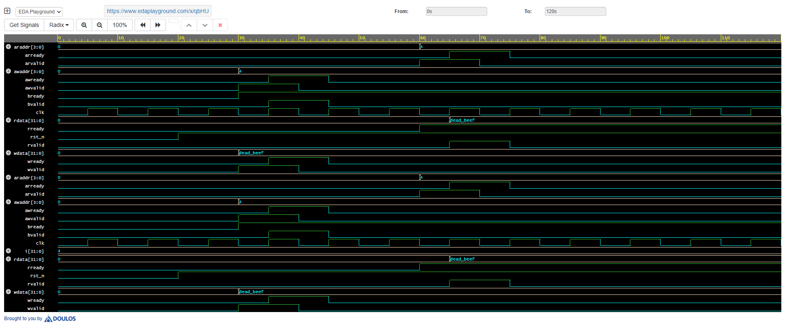

# AXI-Lite Slave Register Block (Verilog HDL)

A **simplified AXI-Lite slave register block** implemented using **Verilog HDL**.  The design supports basic **memory-mapped read and write transactions** and demonstrates core **AXI-Lite VALID–READY handshaking** used in SoC peripherals.

## Features
- AXI-Lite read & write interface (simplified)
- 4 × 32-bit memory-mapped registers
- VALID–READY handshake implementation
- Synthesizable RTL design
- Verified using simulation and waveform analysis

## Register Map

| Address Offset | Register |
|---------------|----------|
| `0x00` | REG0 |
| `0x04` | REG1 |
| `0x08` | REG2 |
| `0x0C` | REG3 |

## How It Works
1. Master provides write address (`AWADDR`) and data (`WDATA`)
2. Slave acknowledges using `AWREADY` and `WREADY`
3. Data is written into the selected register
4. Write completion is indicated using `BVALID`
5. For read operations:
   - Master sends `ARADDR`
   - Slave responds with `RDATA` and `RVALID`

## Simulation
- Simulator: **Icarus Verilog**
- Platform: **EDA Playground**
- Waveform Viewer: **EPWave**

## Output Waveform
The waveform below shows:
- AXI-Lite write transaction storing `0xDEADBEEF`
- AXI-Lite read transaction returning the same value
- Proper VALID–READY handshakes on all channels

## Files
- `axi_lite_slave.v` – AXI-Lite slave RTL module  
- `tb_axi_lite.v` – Testbench for simulation  

## Applications
- Memory-mapped control registers
- SoC peripheral interfaces
- FPGA-based accelerators
- Embedded system configuration blocks

